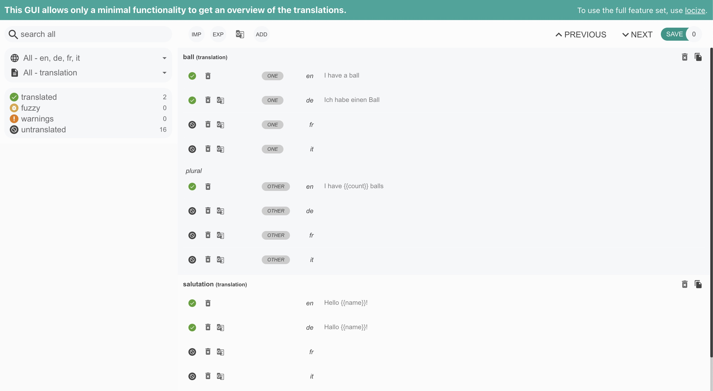

# Introduction

[](https://www.npmjs.com/package/translation-check)

This package shows an overview of your translations. Check which keys are not yet translated.



# Getting started

Source can be loaded via [npm](https://www.npmjs.com/package/translation-check) or via [jsdelivr CDN](https://cdn.jsdelivr.net/npm/translation-check/dist/umd/translationCheck.js).

```bash
# npm package
$ npm install translation-check
```

```html
<script src="https://cdn.jsdelivr.net/npm/translation-check/dist/umd/translationCheck.min.js" ></script>
<script>
  // window.translationCheck.i18nextPlugin
  // window.translationCheck.showTranslations()
</script>
```


## Usage with i18next

### Use it as plugin:

```js
import i18next from 'i18next'
import { i18nextPlugin } from 'translation-check'

i18next.use(i18nextPlugin).init({
  // ...your i18next options
})
// or with custom options
// i18next.use(i18nextPlugin).init({
//   translationStats: { // optional options, if not provided it will guess based on your i18next config
//     queryStringParam: 'showtranslations',
//     sourceLng: 'en',
//     targetLngs: ['de', 'it'],
//     preserveEmptyStrings: false
//   }
// })
```

Then open your app or website and add `?showtranslations` in your url, i.e. `http://localhost:3000?showtranslations`.


### Alternatively, call it after i18next has loaded all your translations:

```js
import i18next from 'i18next'
import { showTranslations } from 'translation-check'

i18next.init({
  // ...your i18next options
}, (err, t) => {
  // ...
  // somewhere in your UI create a button or link or similar, like that:
  $('#open-editor').click(() => {
    showTranslations(i18next)
    // showTranslations(i18next, { // optional options, if not provided it will guess based on your i18next config
    //   sourceLng: 'en',
    //   targetLngs: ['de', 'it'],
    //   preserveEmptyStrings: false
    // }) 
  })
})
```


## Usage without i18next

```js
import { showTranslations } from 'translation-check'

// ...
// somewhere in your UI create a button or link or similar, like that:
$('#open-editor').click(() => {
  showTranslations({
    en: {
      // this is a namespace, you can also have multiple namespaces
      translation: {
        salutation: 'hello world'
      },
      anotherNS: {
        nice: 'This is a nice day!'
      }
    },
    de: {
      translation: {
        salutation: 'hallo welt'
      },
      anotherNS: {
        nice: 'Es ist ein schöner Tag!'
      }
    }
  })
})
```
